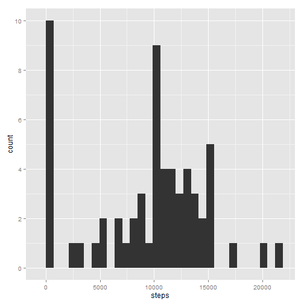
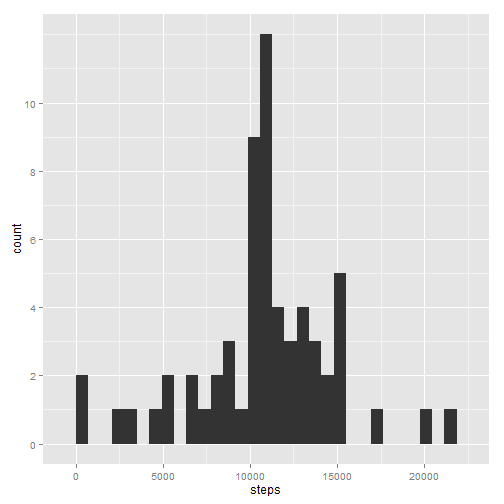

# Reproducible Research Peer Assessment 1
----------------

## Loading and preprocessing the data

```r
library(data.table)
library(ggplot2)
data <- fread("activity.csv")
data$date <- as.Date(data$date)
```


## What is mean total number of steps taken per day?
### Make a histogram of the total number of steps taken each day

```r
dayTotal <- tapply(data$steps, data$date, function(x) sum(x, na.rm = TRUE))
dt <- data.table(date = as.Date(rownames(dayTotal)), steps = dayTotal)

g <- ggplot(dt, aes(x = steps))
g <- g + geom_histogram()
g <- g + scale_y_continuous(breaks = seq(0, 10, 2))
plot(g)
```

```
## stat_bin: binwidth defaulted to range/30. Use 'binwidth = x' to adjust this.
```

 


### Calculate and report the mean and median total number of steps taken per day

```r
tapply(data$steps, data$date, function(x) mean(x, na.rm = TRUE))
```

```
## 2012-10-01 2012-10-02 2012-10-03 2012-10-04 2012-10-05 2012-10-06 
##        NaN     0.4375    39.4167    42.0694    46.1597    53.5417 
## 2012-10-07 2012-10-08 2012-10-09 2012-10-10 2012-10-11 2012-10-12 
##    38.2465        NaN    44.4826    34.3750    35.7778    60.3542 
## 2012-10-13 2012-10-14 2012-10-15 2012-10-16 2012-10-17 2012-10-18 
##    43.1458    52.4236    35.2049    52.3750    46.7083    34.9167 
## 2012-10-19 2012-10-20 2012-10-21 2012-10-22 2012-10-23 2012-10-24 
##    41.0729    36.0938    30.6285    46.7361    30.9653    29.0104 
## 2012-10-25 2012-10-26 2012-10-27 2012-10-28 2012-10-29 2012-10-30 
##     8.6528    23.5347    35.1354    39.7847    17.4236    34.0938 
## 2012-10-31 2012-11-01 2012-11-02 2012-11-03 2012-11-04 2012-11-05 
##    53.5208        NaN    36.8056    36.7049        NaN    36.2465 
## 2012-11-06 2012-11-07 2012-11-08 2012-11-09 2012-11-10 2012-11-11 
##    28.9375    44.7326    11.1771        NaN        NaN    43.7778 
## 2012-11-12 2012-11-13 2012-11-14 2012-11-15 2012-11-16 2012-11-17 
##    37.3785    25.4722        NaN     0.1424    18.8924    49.7882 
## 2012-11-18 2012-11-19 2012-11-20 2012-11-21 2012-11-22 2012-11-23 
##    52.4653    30.6979    15.5278    44.3993    70.9271    73.5903 
## 2012-11-24 2012-11-25 2012-11-26 2012-11-27 2012-11-28 2012-11-29 
##    50.2708    41.0903    38.7569    47.3819    35.3576    24.4688 
## 2012-11-30 
##        NaN
```

```r
tapply(data$steps, data$date, function(x) median(x, na.rm = TRUE))
```

```
## 2012-10-01 2012-10-02 2012-10-03 2012-10-04 2012-10-05 2012-10-06 
##         NA          0          0          0          0          0 
## 2012-10-07 2012-10-08 2012-10-09 2012-10-10 2012-10-11 2012-10-12 
##          0         NA          0          0          0          0 
## 2012-10-13 2012-10-14 2012-10-15 2012-10-16 2012-10-17 2012-10-18 
##          0          0          0          0          0          0 
## 2012-10-19 2012-10-20 2012-10-21 2012-10-22 2012-10-23 2012-10-24 
##          0          0          0          0          0          0 
## 2012-10-25 2012-10-26 2012-10-27 2012-10-28 2012-10-29 2012-10-30 
##          0          0          0          0          0          0 
## 2012-10-31 2012-11-01 2012-11-02 2012-11-03 2012-11-04 2012-11-05 
##          0         NA          0          0         NA          0 
## 2012-11-06 2012-11-07 2012-11-08 2012-11-09 2012-11-10 2012-11-11 
##          0          0          0         NA         NA          0 
## 2012-11-12 2012-11-13 2012-11-14 2012-11-15 2012-11-16 2012-11-17 
##          0          0         NA          0          0          0 
## 2012-11-18 2012-11-19 2012-11-20 2012-11-21 2012-11-22 2012-11-23 
##          0          0          0          0          0          0 
## 2012-11-24 2012-11-25 2012-11-26 2012-11-27 2012-11-28 2012-11-29 
##          0          0          0          0          0          0 
## 2012-11-30 
##         NA
```


## What is the average daily activity pattern?

### Make a time series plot (i.e. type = "l") of the 5-minute interval (x-axis) and the average number of steps taken, averaged across all days (y-axis)

```r
intervalTotal <- tapply(data$steps, data$interval, function(x) mean(x, na.rm = TRUE))
dt <- data.table(interval = as.numeric(rownames(intervalTotal)), steps = intervalTotal)

g <- ggplot(dt, aes(x = interval, y = steps))
g <- g + geom_line()
plot(g)
```

 


### Which 5-minute interval, on average across all the days in the dataset, contains the maximum number of steps?

```r
dt$interval[dt$steps == max(dt$steps)]
```

```
## [1] 835
```


## Imputing missing values
### Calculate and report the total number of missing values in the dataset (i.e. the total number of rows with NAs)

```r
nrow(data[is.na(data$steps)])
```

```
## [1] 2304
```


### Devise a strategy for filling in all of the missing values in the dataset. The strategy does not need to be sophisticated. For example, you could use the mean/median for that day, or the mean for that 5-minute interval, etc.

### Create a new dataset that is equal to the original dataset but with the missing data filled in.

```r
# the missing data are filled with the mean for that 5-minute interval
data2 <- data
for (i in 1:nrow(data[is.na(data$steps)])) {
    
    data2$steps[is.na(data$steps)][i] <- mean(data$steps[data$interval == data$interval[is.na(data$steps)][i]], 
        na.rm = TRUE)
    
}
```


### Make a histogram of the total number of steps taken each day and Calculate and report the mean and median total number of steps taken per day. Do these values differ from the estimates from the first part of the assignment? What is the impact of imputing missing data on the estimates of the total daily number of steps?

```r
dayTotal <- tapply(data2$steps, data2$date, function(x) sum(x, na.rm = TRUE))
dt <- data.table(date = as.Date(rownames(dayTotal)), steps = dayTotal)

g <- ggplot(dt, aes(x = steps))
g <- g + geom_histogram()
g <- g + scale_y_continuous(breaks = seq(0, 10, 2))
plot(g)
```

```
## stat_bin: binwidth defaulted to range/30. Use 'binwidth = x' to adjust this.
```

 


## Are there differences in activity patterns between weekdays and weekends?

### Create a new factor variable in the dataset with two levels – “weekday” and “weekend” indicating whether a given date is a weekday or weekend day.

```r
# '土曜日' means Saturday in Japanese '日曜日' means Sunday in Japanese
weekdaysf <- sapply(weekdays(data2$date), function(x) if (x == "土曜日" | x == 
    "日曜日") {
    "weekend"
} else {
    "weekday"
})
data2 = cbind(data2, weekday = as.factor(weekdaysf))
```


### Make a panel plot containing a time series plot (i.e. type = "l") of the 5-minute interval (x-axis) and the average number of steps taken, averaged across all weekday days or weekend days (y-axis). 


```r
# data table for weekday
intervalTotal <- tapply(data2$steps[data2$weekday == "weekday"], data2$interval[data2$weekday == 
    "weekday"], function(x) mean(x, na.rm = TRUE))
intervalTotalw <- rep("weekday", nrow(intervalTotal))
intervalTotal <- data.table(interval = as.numeric(rownames(intervalTotal)), 
    steps = intervalTotal, weekday = intervalTotalw)

# data table for weekend
intervalTotal2 <- tapply(data2$steps[data2$weekday == "weekend"], data2$interval[data2$weekday == 
    "weekend"], function(x) mean(x, na.rm = TRUE))
intervalTotalw2 <- rep("weekend", nrow(intervalTotal2))
intervalTotal2 <- data.table(interval = as.numeric(rownames(intervalTotal2)), 
    steps = intervalTotal2, weekday = intervalTotalw2)

# rbind weekday and weekdend
dt <- rbind(intervalTotal, intervalTotal2)

# plot
g <- ggplot(dt, aes(x = interval, y = steps))

g <- g + facet_grid(weekday ~ .)
g <- g + geom_line()
plot(g)
```

 


